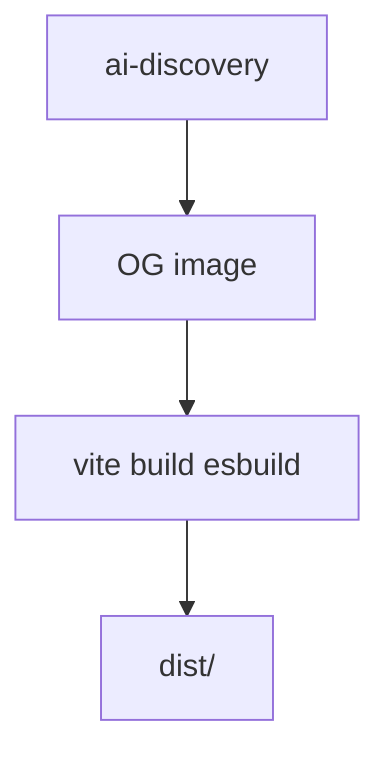
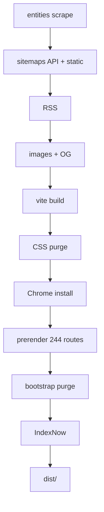

# Build Pipeline

360Ghar has **three build tracks**:

| Track | Command | When | Wall clock target |
|-------|---------|------|-------------------|
| **Deploy preview** | `npm run build:preview` (`BUILD_FAST=1`) | Every Netlify deploy preview / branch deploy | few seconds |
| **Production deploy** | `npm run build:full` (`FULL_BUILD=1`) | GitHub Actions `content-build.yml` | several minutes (Puppeteer + API) |
| **Content precompute** | `npm run build:content` | Scheduled `precompute-content.yml` | many minutes (API + images) |

Netlify preview builds **do not** install Chrome, scrape competitor sitemaps, crawl the property API, prerender 244 routes, or run heavy Vite plugins. Production deploys are built in GitHub Actions and uploaded via `netlify-cli`. The `precompute-content.yml` job refreshes vendored sitemaps, RSS, localities, and optimized images so those steps can be skipped on fast builds.

## Key Files

| File | Role |
|------|------|
| `scripts/build.mjs` | Orchestrator (fast vs `FULL_BUILD=1`, `SKIP_PRECOMPUTE=1`) |
| `scripts/build-content.mjs` | Precompute-only orchestrator (no Vite/Puppeteer) |
| `package.json` | `build`, `build:full`, `build:content`, `build:preview`, sub-scripts |
| `netlify.toml` | Deploy command = `npm run build:preview`; production builds ignored |
| `.github/workflows/content-build.yml` | `main` push + nightly full build + Netlify CLI deploy |
| `.github/workflows/precompute-content.yml` | Nightly content precompute + commit to `main` |
| `vite.config.js` | Vite build (esbuild minify; `BUILD_FAST` disables PWA/compression) |
| `scripts/optimize-images.mjs` | WebP/AVIF variants with content-hash manifest |
| `scripts/prerender-pages.mjs` | Puppeteer prerender (**full build only**) |
| `scripts/lib/prerenderCache.mjs` | Prerender HTML cache (full build only) |

## Scripts

```json
"build": "node scripts/build.mjs",
"build:full": "FULL_BUILD=1 node scripts/build.mjs",
"build:content": "node scripts/build-content.mjs",
"build:preview": "BUILD_FAST=1 npm run build:ai-discovery && BUILD_FAST=1 node scripts/generate-og-image.mjs && BUILD_FAST=1 vite build"
```

## Deploy preview path (`BUILD_FAST=1`)



Steps:

1. `build:ai-discovery` + OG image.
2. `vite build` — esbuild minify, **no gzip/brotli**, **no PWA**, **no image re-processing**. `BUILD_FAST=1` disables heavy plugins.

**Skipped on deploy preview:** Chrome install, entity scrape, sitemap/RSS generation, image optimization, Puppeteer prerender, CSS purge, IndexNow, PWA, compression.

## Content path (`FULL_BUILD=1`)



Same stages as the historical production pipeline: entities, full sitemaps (including dynamic property crawl), RSS, images, vite, CSS purge, Chrome install, concurrent Puppeteer prerender (~244 routes), IndexNow.

When `SKIP_PRECOMPUTE=1` is set, the entities/sitemaps/RSS/images/OG/AI-discovery steps are skipped and the vendored artifacts from `main` are reused. This is used by the `content-build.yml` push trigger.

### Vendored artifacts

The `precompute-content.yml` job commits these so preview builds and `content-build.yml` push builds can skip regeneration:

- `src/data/localities.json`, `src/data/localities-index.json`
- `public/sitemap*.xml` (static, landing, localities, datahub, properties, blog, projects)
- `public/rss.xml`, `public/rss/*`
- `public/.well-known/ai.txt`, `public/.well-known/api-catalog`
- `public/llms.txt`, `public/llms-full.txt`, `public/data/llm-feed.json`
- `public/og-image-home.jpg`
- `public/assets/images/**/*.webp` and `**/*.avif`
- `scripts/image-optimization-manifest.json`

### Prerender notes

- Concurrency: `PRERENDER_CONCURRENCY` (default 5, max 8).
- Cache dir: `PRERENDER_CACHE_DIR` (default `node_modules/.cache/prerender-html`).
- Cache keys include vite asset hash + bulk-data hash — **any code or live listing change tends to cold-miss**. Do not rely on this cache to make deploys fast; keep prerender off the deploy path instead.
- Bulk data: `fetch-prerender-data.mjs` → `dist/prerender-data.json`.

## Netlify

```toml
[build]
  publish = "dist"
  command = "npm run build:preview"

[build.environment]
  NODE_VERSION = "20"
  VITE_API_SERVER = "https://api.360ghar.com"
  VITE_API_BASE_URL = "https://api.360ghar.com/api/v1"
  SKIP_BROTLI = "1"

[context.production]
  ignore = "echo 'Production built by GitHub Actions' && exit 0"
```

Netlify only builds **deploy previews** and **branch deploys**. Production deploys are uploaded from GitHub Actions.

## GitHub workflows

### `.github/workflows/content-build.yml`

- Triggers: `push` to `main`, nightly cron (~00:00 IST), `workflow_dispatch`
- Runs `npm run build:full` (with `SKIP_PRECOMPUTE=1` on `push` to reuse vendored artifacts)
- Deploys with:
  ```bash
  npx netlify-cli deploy --prod --dir=dist --no-build --message "content-build $GITHUB_SHA"
  ```
  **`--no-build` is mandatory.** Without it, the CLI re-runs `build.command` (`build:preview`) and overwrites the full `dist/` artifact (root cause contributor for the 2026-07-14 outage).
- Post-deploy smoke: asserts `/`, `/properties`, `/about-us` return 200 (not self-301) and homepage body is HTML.
- Requires secrets `NETLIFY_AUTH_TOKEN` and `NETLIFY_SITE_ID`

### `.github/workflows/precompute-content.yml`

- Triggers: nightly cron (~30 minutes before `content-build.yml`), `workflow_dispatch`
- Runs `npm run build:content` and commits the vendored artifacts to `main` with `[skip ci]`
- Keeps `public/`, `src/data/`, and `scripts/image-optimization-manifest.json` up to date so preview builds can skip heavy work

## Stage reference (full build)

### 1. Entity Ingestion (`build:entities`)

Scrapes Magicbricks / SquareYards / NoBroker / CommonFloor; writes `localities.json` + index + locality sitemap.

### 2. AI Discovery

`write-ai-discovery.mjs` → `ai.txt`, `api-catalog`, `llms.txt`, `llm-feed.json`.

### 3. Sitemaps

Static, landing, localities, datahub (API), dynamic properties/blog (API).

### 4. RSS

Blog + properties + localities feeds.

### 5. Images

`optimize-images.mjs` — WebP/AVIF (+ responsive widths for heroes). Idempotent.

### 6–7. Vite + CSS purge

esbuild minify; PurgeCSS on entry CSS and Bootstrap.

### 8. Prerender

Route manifest → bulk API data → Puppeteer capture to `dist/**/*.html`.

### 9. IndexNow

Submit same-host sitemap URLs after full build.

## Edge Functions

**Disabled in production (2026-07-14).** Active dir `netlify/edge-functions/` is empty; implementations are parked under `netlify/edge-functions-disabled/` (`soft-404-guard.js`, `markdown-negotiation.js`). Re-enable only after the checklist in that folder’s README (deploy-preview smoke: 200s, no self-301, edge logs clean).

## Why deploys used to take 10+ minutes

1. Production treated every deploy as a full content build.
2. Chrome + **244 Puppeteer routes** dominated wall time.
3. API property crawls + competitor entity scrapes added more network minutes.
4. Vite re-optimized images already processed by Sharp; terser minify was slower than esbuild.
5. Prerender cache almost always missed (global bulk-data hash + per-deploy asset hash).

## Dependency notes

- **Node** >= 18 (Netlify pins 20).
- **Puppeteer** only required for `build:full`.
- **sharp** for `optimize-images.mjs`.
- ESLint stays on major 9 (peer constraint with `eslint-plugin-react`).

## Cross-References

- [SEO & Programmatic](../features/SEO-Programmatic)
- [Internationalization](../features/Internationalization)
- [Authentication](../features/Authentication) — prerender skips auth init
- [Analytics](../features/Analytics) — prerender skips PostHog
